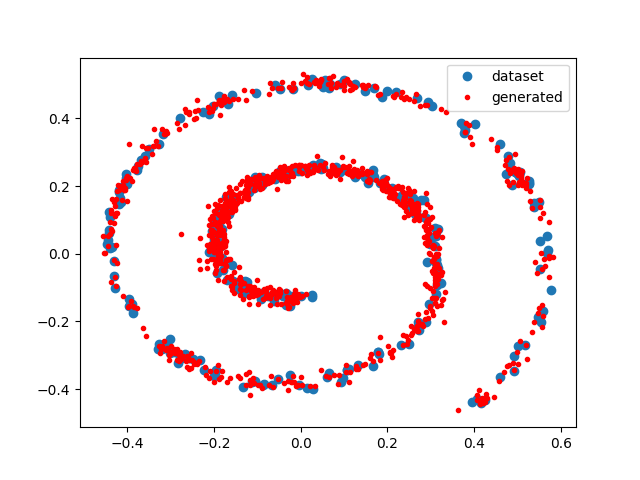

# FastParzenWindows.jl

## ℹ What is this?

This is a Julia implementation of the Fast Parzen Window Density Estimator described in 

*X. Wang, P. Tino, M. A. Fardal, S. Raychaudhury and A. Babul, "Fast parzen window density estimator," 2009 International Joint Conference on Neural Networks, 2009, pp. 3267-3274.*

This is a technique for estimating a probability density from an observed set of data points. The data space is partitioned in hyper-discs of fixed radii `r` and each partition is modelled with a Gaussian density.  The final model is a mixture of Gaussians with each Gaussian fitted locally to a partition.


The algorithm presented in the paper has two versions called 'hard' and 'soft'.  This repository only provides the 'soft' version.


## 💾 How to install

Apart from cloning, an easy way of using the package is the following:

1 - Add the registry [AINJuliaRegistry](https://github.com/HITS-AIN/AINJuliaRegistry).

2 - Switch into "package mode" with ```]``` and add the package with
```
add FastParzenWindows
```


In case you are installing `FastParzenWindows` to an existing Julia environment, there is a chance one may run into dependency problems that prevent installation. In this case, it is advisable to work in a new [environment](https://pkgdocs.julialang.org/v1/environments/). That is
```
mkdir("MyFastParzenWindows") # example name, can be different
cd("MyFastParzenWindows")
# press `]` to enter package mode:
(@v1.6) pkg> activate .
```
and use this environment for installing and working with the package.
Having exited Julia, one can enter the created environment again by simply starting Julia in the respective folder and using `activate .` in package mode.

## ⬆ Updating the package

Switch into "package mode" with ```]``` and add type ```registry update AINJuliaRegistry```. 

This will make Julia update all packages associated with ```AINJuliaRegistry``` registry. 

Alternatively, you enter package mode and type ```up```. This will update all packages in Julia, including this one.


## ▶ How to use

There are two functions of interest: `fpw` and `cv_fpw`.

- `fpw` takes two arguments, a N×D data matrix `X` and a scalar `r` which expresses the radius of the hyper-discs in which the data space is partitioned. The output is an object of the type `Distributions.MixtureModel`.
- `cv_fpw` takes two arguments, a N×D data matrix `X` and a range of candidate radii of the hyper-discs. It performs cross-validation for each candidate `r` and returns a matrix of out-of-sample log-likelihoods of dimensions (number of `r` candidates)×(number of folds).


## ▶ Example

We use a dataset taken from the paper. We generate 300 data points using:
```
using FastParzenWindows
using PyPlot # must be independently installed
using Statistics

X = spiraldata(300)

plot(X[:,1], X[:,2], "bo", label="dataset")
```

We want to find out which `r` works well for this dataset:
```
# define range of 100 candidate radii
r_range = LinRange(0.01, 2.0, 100)

# perform cross-validation
cvresults = cv_fpw(X, r_range)

# which is the best r?
r_perf = mean(cvresults, dims=2)
best_index = argmax(r_perf)

r_best = r_range[best_index]
```

Estimate final model:
```
mix = fpw(X, r_best)

# generate observations and plot them
x = rand(mix, 1000)'
plot(x[:,1], x[:,2], "r.", label="generated")
legend()

```


